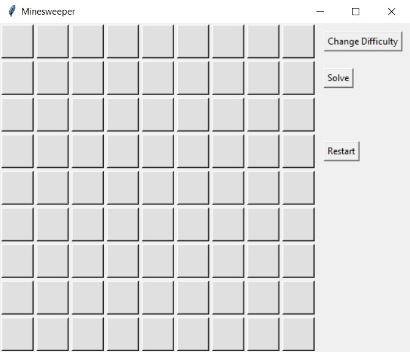
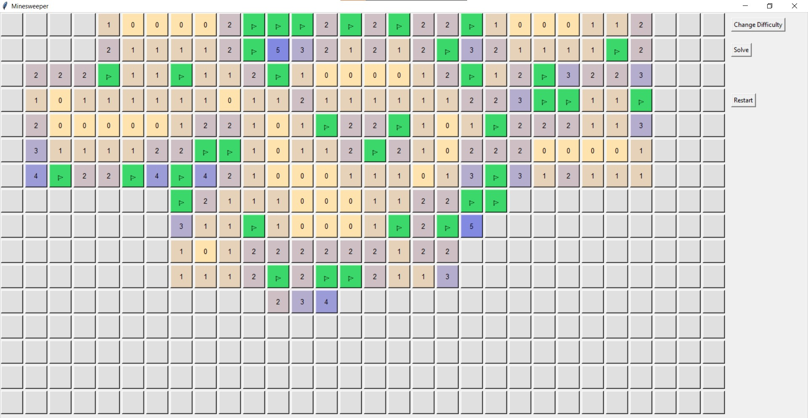
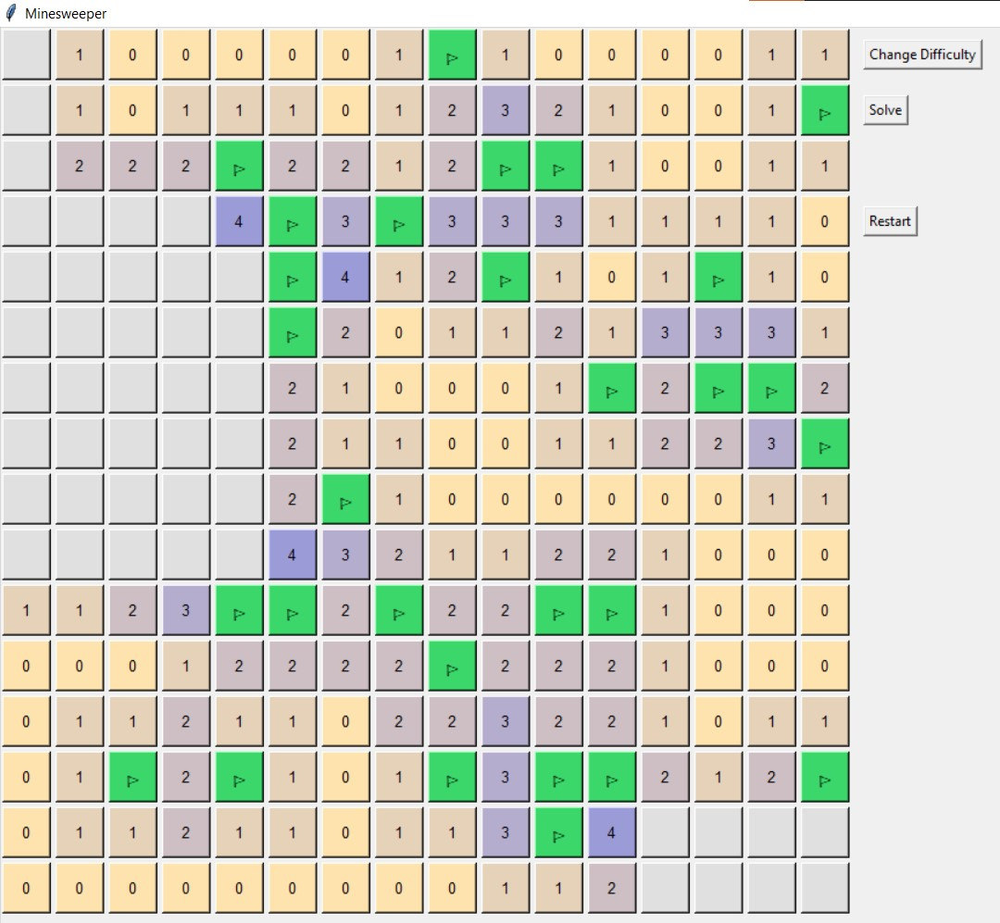
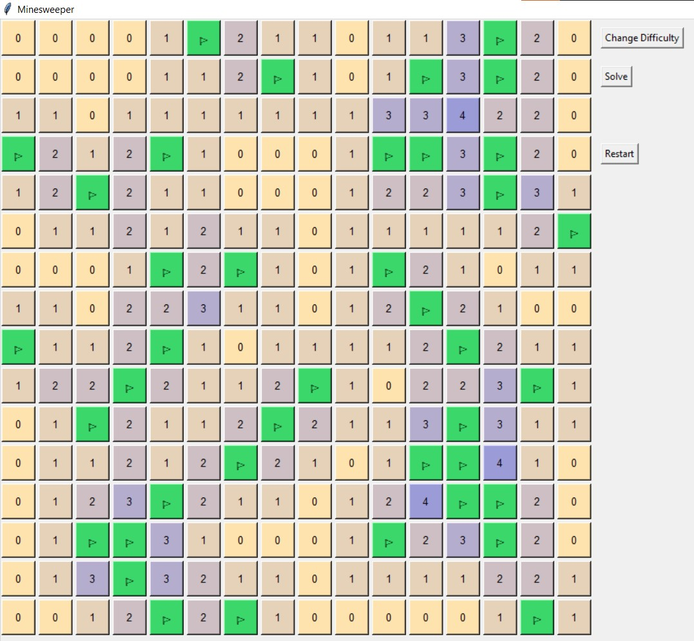

# Minesweeper Solver - Single Point Strategy

## Description

This project implements a Minesweeper solver using the **Single Point Strategy** algorithm. The solver is integrated into a graphical user interface (GUI) built with **Tkinter** in Python. The solver can automatically solve Minesweeper grids by flagging and opening cells based on the game's rules. When the solver encounters an uncertain situation (e.g., a 50/50 chance), it will stop and notify the user that it could not determine a solution.

The project consists of two main files:
- `minesweeper_gui.py`: Contains the GUI code and the solver's algorithm.
- `minesweeper_player.py`: Contains functions to interact with the game, including tracking the time it takes to solve the grid.

### Features:
- **GUI for Minesweeper** with buttons to:
  - Restart the game and generate a new grid.
  - Change the grid difficulty (Beginner, Intermediate, Expert).
  - Solve the current grid.
- The solver works by traversing the grid and using a **Single Point Strategy** to flag and open cells. If a solution is not possible, it stops and provides a notification.
- Option to measure the time taken for the solver to complete using the **play_game_time** function (needs improvement).


## How to Use

### Requirements
- Python 3
- Tkinter (usually comes pre-installed with Python)

### Running the Game and Solver

1. **Clone the repository:**
   ```bash
   git clone https://github.com/narekatsy/minesweeper-solver.git
   cd minesweeper-solver
   ```

2. **Run the GUI**
   ```bash
   python minesweeper_player.py
   ```

3. **Interacting with the GUI**
- **Start New Game**: Press the "Restart" button to create a random Minesweeper grid.
- **Difficulty Levels**: Choose between Beginner, Intermediate, or Expert difficulty using the "Change Difficulty" button.
- **Solve the Grid**: Press the "Solve" button to trigger the solver. The solver will flag and open the cells based on the current grid.


## Interface

#### 1. Unopened Grid
The following image shows the initial state of the Minesweeper grid, with all the cells unopened. The user can interact with the cells, flag mines, or start the solving process from here.



#### 2. Expert Level Grid (Working Process)
Here is an example of the Expert level grid, where half of the cells are opened, and some of the cells are flagged. This represents the solver's working process as it tries to deduce the positions of the remaining mines. The grid starts to reveal and flag cells based on the Single Point (SP) strategy.



#### 3. Solver Stuck
In this screenshot, the solver has encountered a scenario where it cannot definitively solve a particular cell. The process stops when there are multiple possibilities (e.g., a 50/50 chance) and the solver is unable to proceed further.



#### 4. Fully Solved Grid
This image shows the final result where the solver has successfully completed the grid. All the cells are opened or flagged, and the game is solved without any remaining uncertainties.




## Contributing
Feel free to fork the repository, make changes, and submit a pull request. Any contributions to improve the solver or interface are welcome!
